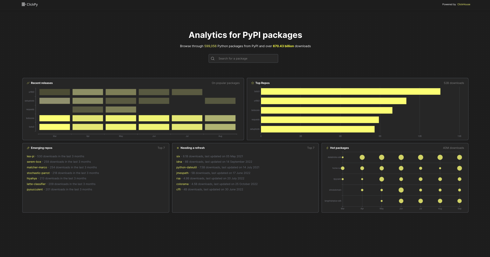
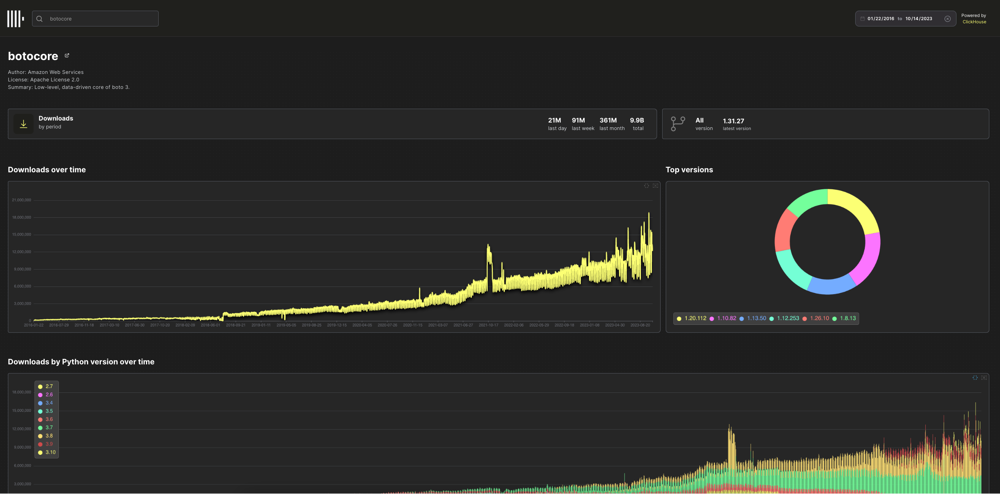

# ClickPy - Analytics on Python package downloads powered by ClickHouse

**ClickPy = ClickHouse + PyPI package downloads + NextJS**

Available at [clickpy.clickhouse.com](https://clickpy.clickhouse.com)






Every Python package download e.g. `pip install`, anywhere, anytime, produces a row. The result is hundreds of billions of rows (closing in on a Trillion at 1.4b a day).

Interested to see how your package is being adopted? how its being installed? which countries are popular? Or maybe you're just curious to see which pacakges are emerging or hot right now?

ClickPy, using ClickHouse, answers these with real-time analytics on PyPI package downloads.

All open-source and reproducible.

## Features

- 600+ billion rows
- Almost 600k packages
- Top packages and recent releases
- Emerging repos - most popular new packages released in the last 6 months
- Needing a refresh - popular packages not updated in the last 6 months
- Hot packages - Biggest changes in downloads in the last 6 months
- Download statistics for any Python package over time
- For any package:
    - Download statistics over time with drill-down
    - Downloads by python version over time
    - Downloads by Python version over time
    - Downloads by system over time
    - Downloads by country
    - File types by installer
    - Slice and dice by version, time, python version, installer or country

Powered by ClickHouse. App in NextJS.

## Motivation

Many of us learn best by example and doing. This app is for those wanting to build a real-time analytics applications.

Real-time analytics applications have a few requirements:

- Billions of rows
- Low latency queries allowing users to slice and dice with filters
- High query concurrency
- A great user experience

Anyone who is building a such an application has similar challenges.

- Which database to use? ClickHouse obviously :)
- How to use ClickHouse to get the best performance? ClickPy is your example.

## PyPI data

Python is ubiquitous and the programming language we often getting started with or turn to for quick tasks.

The Python Package Index, abbreviated as PyPI and also known as the Cheese Shop, is the official third-party software repository for Python. Python developers, use this for hosting and installing packages. By default, pip uses PyPI to look for packages.

Every time a package is downloaded, a log line is generated containing in a CDN logs. This contains the details you would expect:

- the package name
- the version
- ip address of download (obfuscated and resolved to country)
- python verison used
- installer mechanism
- system used
- and more..

PyPI does not display download statistics for a number of reasons described [here](https://packaging.python.org/en/latest/guides/analyzing-pypi-package-downloads/#id8) - not least its inefficient and hard to work with a CDN.

Instead, an [implementation of linehard](https://github.com/pypi/linehaul-cloud-function) feeds this data to BigQuery where its [queryable as a public dataset](https://packaging.python.org/en/latest/guides/analyzing-pypi-package-downloads/#public-dataset).


BigQuery is great as a data warehouse. But its neither fast enough or able to handle the concurrency required to power a user facing analytics.

The solution? ClickHouse - the fastest and most resource efficient open-source database for real-time apps and analytics.

This requires us to export the BigQuery data to a GCS bucket and import it into ClickHouse.

## How is this all soo fast? Whats the secret sauce?

Two main reasons:

- ClickHouse was designed to be fast for analytics data. See [Why is ClickHouse so fast?](https://clickhouse.com/docs/en/concepts/why-clickhouse-is-so-fast)
- Materialized views and dictionaries

### Materialized views


### Dictionaries


## Deployment

Either go to the public example at [clickpy.clickhouse.com](https://clickpy.clickhouse.com) or deploy yourself.

For the latter you have 2 choices:

 - Export the BigQuery data yourself to GCS and import into ClickHouse
 - Use the public instance of ClickHouse with read-only credentials (see below)*

We cover both options below.

 * This instance is sufficient to run the application but has quotas applied.

## Dependencies

- node >= v16.15
- npm >= 9.1
- ClickHouse >= 23.8
- Python >= 3.8 (if loading data from GCS)

## ClickHouse

### Public instance

For users wishing to make changes to just the app, and use the existing ClickHouse instance with the data, the following credentials can be used:

```
host: https://clickpy-clickhouse.clickhouse.com
port: 443
user: play
```
See [App Configuration](#app-configuration).

### Self-hosted

#### Creating tables and views

ClickPy relies on two main tables: `pipi` and `projects` within a `pypi` database. `pypi` is the majority of this with a row for every package download at over 600b rows. The `projects` table contains a row per package and contains < 1m rows.

As well as these two main tables, ClickPy relies on materialized views and dictionaries to provide the sub-second query performance across over 600 billion rows.

Users can either use the script `./scripts/create_tables.sh` to create the required views, dictionaries and tables or perform this step by hand - see [ClickHouse.md](./ClickHouse.md) for full details on the table schemas and DDL required.

The `create_tables.sh` assumes the clickhouse instance is secured by SSL, using the `--secure` flag for the `clickhouse-client`. Modify as required.

```bash
CLICKHOUSE_USER=default CLICKHOUSE_HOST=example.clickhouse.com CLICKHOUSE_PASSWORD=password ./create_tables.sh
```

For details on populating the database, see [Importing data](#importing-data) below.

#### Exporting data

For users wanting to host the data themselves, this requires the export of the data from BigQuery - ideally to Parquet, prior to import into ClickHouse. This is significant export (15TB) and can take multiple hours to run. The following query will export the data into a single bucket:

```sql
DECLARE export_path string;
SET export_path = CONCAT('gs://<bucket>/file_downloads-*.parquet');

EXPORT DATA
OPTIONS (
    uri = (export_path),
    format = 'PARQUET',
    overwrite = true
)
AS (
SELECT timestamp, 
    country_code, 
    url, 
    project, 
    file, 
    STRUCT<name string, version string>(details.installer.name, details.installer.version) as installer,
    details.python as python,
    STRUCT<name string, version string>(details.implementation.name, details.implementation.version) as implementation,
    STRUCT<name string, version string, id string, libc STRUCT<lib string, version string>>(details.distro.name, details.distro.version, details.distro.id,(details.distro.libc.lib, details.distro.libc.version)) as distro,
    STRUCT<name string, release string>(details.system.name, details.system.release) as system,
    details.cpu as cpu,
    details.openssl_version as openssl_version,
    details.setuptools_version as setuptools_version, details.rustc_version as rustc_version, tls_protocol, tls_cipher
    FROM bigquery-public-data.pypi.file_downloads WHERE timestamp > '2000-01-01 00:00:00'
);
```

The export can also be broken up using techniques described [here](https://clickhouse.com/docs/en/migrations/bigquery#1-export-table-data-to-gcs).

Files will be exported with a numeric suffix e.g. `file_downloads-000000000012.parquet`.

#### Importing data

The `projects` table and dictionary data can be populated with a few simple `INSERT INTO SELECT` statements:

```sql
INSERT INTO projects SELECT *
FROM s3('https://storage.googleapis.com/clickhouse_public_datasets/pypi/packages/packages-*.parquet')

INSERT INTO countries SELECT
    name,
    `alpha-2` AS code
FROM url('https://gist.githubusercontent.com/gingerwizard/963e2aa7b0f65a3e8761ce2d413ba02c/raw/4b09800f48d932890eedd3ec5f7de380f2067947/country_codes.csv')
```

A simple `./scripts/populate.sh` replicates these commands.

For the larger `pypi` table we the scripts provided [here](https://github.com/ClickHouse/examples/tree/main/large_data_loads).

Alternatively the following can be used as the basis for importing the data in chunks manually by using glob patterns. In the example below we target the files with a numeric suffix beginning with `-00000000001*`. Provide the locations to your bucket via `<bucket>`:

```sql
INSERT INTO pypi SELECT timestamp::Date as date, country_code, project, file.type as type, installer.name as installer, arrayStringConcat(arraySlice(splitByChar('.', python), 1, 2), '.') as python_minor, system.name as system, file.version as version FROM s3('https://<bucket>/file_downloads-00000000001*.parquet', 'Parquet', 'timestamp DateTime64(6), country_code LowCardinality(String), url String, project String, `file.filename` String, `file.project` String, `file.version` String, `file.type` String, `installer.name` String, `installer.version` String, python String, `implementation.name` String, `implementation.version` String, `distro.name` String, `distro.version` String, `distro.id` String, `distro.libc.lib` String, `distro.libc.version` String, `system.name` String, `system.release` String, cpu String, openssl_version String, setuptools_version String, rustc_version String,tls_protocol String, tls_cipher String') WHERE python_minor != '' AND system != '' SETTINGS input_format_null_as_default = 1, input_format_parquet_import_nested = 1
```

For details on tuning insert performance, see [here](https://clickhouse.com/blog/supercharge-your-clickhouse-data-loads-part2).

### App Configuration

Copy the file `.env.example` to `.env.local`.

Modify the settings with your clickhouse cluster details e.g.

```
CLICKHOUSE_HOST=https://host.clickhouse.com
CLICKHOUSE_USERNAME=default
CLICKHOUSE_PASSWORD=password
PYPI_DATABASE=pypi
```

## Deploying

To run locally:

```bash
npm run dev
```

The easiest way to deploy the Next.js app is to use the [Vercel Platform](https://vercel.com/new) from the creators of Next.js.

We welcome other contributions helping with deployment.

## Contributing and Development

Just another NextJS project, run the development server:

```bash
npm run dev
# or
yarn dev
# or
pnpm dev
```

Open [http://localhost:3000](http://localhost:3000) with your browser to see the result.

Please fork and raise PR's to contribute. Changes and ideas welcome.

## License

Apache License 2.0
