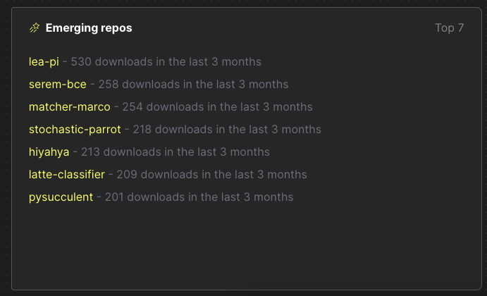

# ClickPy - New Python Package Analytics Service Powered by ClickHouse

Interested to see how your package is being adopted? How often is it being installed? Which countries are popular? Or maybe you're just curious to see which packages are emerging or hot right now?

ClickPy, using ClickHouse, answers these with real-time analytics on PyPI package downloads. Available as a service for users to run locally. All open-source and reproducible.

Available at [clickpy.clickhouse.com](https://clickpy.clickhouse.com).


Every Python package download, e.g. `pip install`, anywhere, anytime, produces a row. The result is hundreds of billions of rows (closing in on a Trillion at 1.4b a day).

The downloads for Python modules are available in BigQuery - a row for every package download in the world and the largest BigQuery public dataset at about 700b rows. Wanting to do some serious analytics leads to a few frustrations, though:

- speed for queries - BigQuery is great for complex SQL, less so for fast analytics.
- cost :) especially if i wanna offer this for free as a service.

With ClickHouse we can provide cost-efficient and fast analytics for free.

## Features

Data

- 600+ billion rows
- Almost 600k packages

Analytics via live dashboards

- Top packages and recent releases
- Emerging repos - most popular new packages released in the last 6 months
- Needing a refresh - popular packages not updated in the last 6 months
- Hot packages - Biggest changes in downloads in the last 6 months
- Download statistics for any Python package over time
- For any package:
    - Download statistics over time with drill-down
    - Downloads by Python version over time
    - Downloads by Python version over time
    - Downloads by system over time
    - Downloads by country
    - File types by installer
    - Slice and dice by version, time, python version, installer or country

Powered by ClickHouse. App in NextJS.

## Motivation

Many of us learn best by example and doing. This app is for those wanting to build real-time analytics applications.

Real-time analytics applications have a few requirements:

- Billions of rows
- Low latency queries allowing users to slice and dice with filters
- High query concurrency
- A great user experience

Anyone who is building such an application has similar challenges.

- Which database to use? ClickHouse obviously :)
- How to use ClickHouse to get the best performance? ClickPy is your example.

## PyPI data

Python is ubiquitous and the programming language we often get started with or turn to for quick tasks.

The Python Package Index, abbreviated as PyPI and also known as the Cheese Shop, is the official third-party software repository for Python. Python developers use this for hosting and installing packages. By default, pip uses PyPI to look for packages.

Every time a package is downloaded, a log entry is generated in a CDN log. This contains the details you would expect:

- the package name
- the version
- IP address of download (obfuscated and resolved to country)
- Python version used
- installer mechanism
- system used
- and more..

PyPI does not display download statistics for a number of reasons described [here](https://packaging.python.org/en/latest/guides/analyzing-pypi-package-downloads/#id8) - not least, it's inefficient and hard to work with a CDN.

Instead, an [implementation of linehard](https://github.com/pypi/linehaul-cloud-function) feeds this data to BigQuery, where it's [queryable as a public dataset](https://packaging.python.org/en/latest/guides/analyzing-pypi-package-downloads/#public-dataset).

BigQuery is great as a data warehouse. But it's neither fast enough nor able to handle the concurrency required to power user-facing analytics.

The solution? ClickHouse - the fastest and most resource-efficient open-source database for real-time apps and analytics.

This requires us to export the BigQuery data to a GCS bucket and import it into ClickHouse.

## How is this all soo fast? Whats the secret sauce?

Two main reasons:

- ClickHouse was designed to be fast for analytics data. See [Why is ClickHouse so fast?](https://clickhouse.com/docs/en/concepts/why-clickhouse-is-so-fast)
- Materialized views and dictionaries

### What is Materialized view in ClickHouse?

In its simplest form, a Materialized view is simply a query that triggers when an insert is made to a table. 

Key to this is the idea that Materialized views don't hold any data themselves. They simply execute a query on the inserted rows and send the results to another "target table" for storage. 

Importantly, the query that runs can aggregate the rows into a smaller result set, allowing queries to run faster on the target table. This approach effectively moves work from **query time to insert time**.

#### A real example

Consider our `pypi` table, where a row represents a download. Suppose we wish to identify the 5 most popular projects. A naive query might do something like this:

```sql
SELECT
    project,
    count() AS c
FROM pypi.pypi
GROUP BY project
ORDER BY c DESC
LIMIT 5

┌─project────┬───────────c─┐
│ boto3      │ 13564182186 │
│ urllib3    │ 10994463491 │
│ botocore   │  9937667176 │
│ requests   │  8914244571 │
│ setuptools │  8589052556 │
└────────────┴─────────────┘

5 rows in set. Elapsed: 182.068 sec. Processed 670.43 billion rows, 12.49 TB (3.68 billion rows/s., 68.63 GB/s.)
```

This requires a full table scan. While 180s might be ok (and 4 billion rows/sec is fast!), it is not quick enough for ClickPy.

A materialized view can help with this query (and many more!). ClickPy uses such a view `pypi_downloads_mv`, shown below.

```sql
CREATE MATERIALIZED VIEW pypi.pypi_downloads_mv TO pypi.pypi_downloads
(
    `project` String,
    `count` Int64

) AS SELECT project, count() AS count
FROM pypi.pypi
GROUP BY project
```

This view executes the aggregation `SELECT project, count() AS count FROM pypi.pypi GROUP BY project` on data that has been inserted into a row. The result is sent to the "target table" `pypi.pypi_downloads`. This, in turn, has a special engine configuration:

```sql
CREATE TABLE pypi.pypi_downloads
(
    `project` String,
    `count` Int64
)
ENGINE = SummingMergeTree
ORDER BY project
```

The [SummingMergeTree](https://clickhouse.com/docs/en/engines/table-engines/mergetree-family/summingmergetree) replaces all the rows with the same `ORDER BY` key (`project` in this case) with one row which contains summarized values for the columns with the numeric data type. Rows with the same `project` value will be asynchronously merged and the `count` summed - hence `SummingMergeTree`.

To query this table, we can use the query below:

```sql
SELECT
    project,
    sum(count) AS c
FROM pypi.pypi_downloads
GROUP BY project
ORDER BY c DESC
LIMIT 5

┌─project────┬───────────c─┐
│ boto3      │ 13564182186 │
│ urllib3    │ 10994463491 │
│ botocore   │  9937667176 │
│ requests   │  8914244571 │
│ setuptools │  8589052556 │
└────────────┴─────────────┘

5 rows in set. Elapsed: 0.271 sec. Processed 599.09 thousand rows, 18.71 MB (2.21 million rows/s., 69.05 MB/s.)
Peak memory usage: 59.71 MiB.
```

180s to 0.27s. Not bad. 

Note how we use a `sum(count`)` in case all rows have not been merged.

The above represents the simplest example of a Materialized view used by ClickPy. For others, see [ClickHouse](./ClickHouse.md). It also represents the case where our aggregation produces a count or sum. Other aggregations (e.g. averages, quantiles etc.) are supported. In fact, all ClickHouse aggregations can have their state stored by a materialized view!

For further details see:

- [An intro to Materialized Views in ClickHouse](https://youtu.be/QUigKP7iy7Y?si=AvKnI-UtDbusbk-y) - this uses ClickPy as an example.
- [Building Real-time Applications with ClickHouse Materialized Views](https://www.youtube.com/watch?v=j_kKKX1bguw) - meetup video, showing ClickPy as an example and how materialized views work.
- [Using Materialized Views in ClickHouse](https://clickhouse.com/blog/using-materialized-views-in-clickhouse) - blog with examples.
- [ Materialized Views and Projections Under the Hood ](https://www.youtube.com/watch?v=QDAJTKZT8y4) - Great video for those interested in internals.

### Dictionaries

Dictionaries provide an in-memory key-value pair representation of our data, optimized for low latent look-up queries. We can utilize this structure to improve the performance of queries in general, with JOINs particularly benefiting where one side of the JOIN represents a look-up table that fits into memory.

In ClickPy's case, we utilize a dictionary `pypi.last_updated_dict` to maintain the last time a package was updated. This is used in several queries to ensure they meet our latency requirements.

For further details on dictionaries, see the blog post [Using Dictionaries to Accelerate Queries](https://clickhouse.com/blog/faster-queries-dictionaries-clickhouse).

### Powering the UI

Broadly, when exploring the ClickPy interface, each visualization is powered by one materialized view. The full list of queries can be found in the file [clickhouse.js](./src/utils/clickhouse.js).

Consider the list of "Emerging repos" on the landing page.



This simple visual is powered by two materialized views: `pypi_downloads_per_day` and `pypi_downloads_per_day`. For the full query, see [here](https://github.com/ClickHouse/clickpy/blob/12d565202b88b97b51d557da0bc777ad65d5ba60/src/utils/clickhouse.js#L380).

#### Choosing the right query

ClickPy is an interactive application. Users can apply filters on the data. While these filters are currently quite limited, we plan to expand them in the future. While materialized views can power a static visualization, filters may mean that a specific view is no longer usable. For example, consider the following chart showing downloads over time (for the popular `Boto3` package):

,

Initially, this chart requires a simple query to the materialized view [`pypi_downloads_per_day`](./ClickHouse.md#pypi_downloads_per_day).

However, if a filter is applied to the `version` column, this view is insufficient - it doesn't capture the `version` column in its aggregation. In this case, we switch to the [`pypi_downloads_per_day_by_version`](./ClickHouse.md#pypi_downloads_per_day_by_version) view.

Why not always use the latter view, you ask? Well, it contains more columns in its aggregation, and thus, the target table has more rows, is larger, and queries are possibly a little slower. Small margins, yes, but important for the best user experience.

Selecting the right view for a visualization involves a simple heuristic. We simply select the view which has the fewest number of columns and covers the set of required columns in the query. The complete logic can be found [here](https://github.com/ClickHouse/clickpy/blob/12d565202b88b97b51d557da0bc777ad65d5ba60/src/utils/clickhouse.js#L28).

## Deployment

Either go to the public example at [clickpy.clickhouse.com](https://clickpy.clickhouse.com) or deploy yourself.

For the latter, you have 2 choices:

 - Export the BigQuery data yourself to GCS and import it into ClickHouse
 - Use the public instance of ClickHouse with read-only credentials (see below)*

We cover both options below.

 * This instance is sufficient to run the application but has quotas applied.

### Dependencies

- node >= v16.15
- npm >= 9.1
- ClickHouse >= 23.8
- Python >= 3.8 (if loading data from GCS)

### ClickHouse

#### Public instance

For users wishing to make changes to just the app and use the existing ClickHouse instance with the data, the following credentials can be used:

```
host: https://clickpy-clickhouse.clickhouse.com
port: 443
user: play
```
Users can connect to this instance with the clickhouse-client and issue queries i.e.

```bash
clickhouse client -h clickpy-clickhouse.clickhouse.com --user play --secure
```

See [App Configuration](#configuration).

#### Self-hosted

##### Creating tables and views

ClickPy relies on two main tables: `pipi` and `projects` within a `pypi` database. `pypi` is the majority, with a row for every package download at over 600b rows. The `projects` table contains a row per package and contains < 1m rows.

As well as these two main tables, ClickPy relies on materialized views and dictionaries to provide the sub-second query performance across over 600 billion rows.

Users can either use the script `./scripts/create_tables.sh` to create the required views, dictionaries, and tables or perform this step by hand - see [ClickHouse.md](./ClickHouse.md) for full details on the table schemas and DDL required.

The `create_tables.sh` assumes the clickhouse instance is secured by SSL, using the `--secure` flag for the `clickhouse-client`. Modify as required.

```bash
CLICKHOUSE_USER=default CLICKHOUSE_HOST=example.clickhouse.com CLICKHOUSE_PASSWORD=password ./create_tables.sh
```

All schemas assume the use of the MergeTree table engine. For users of [ClickHouse Cloud](clickhouse.cloud/), this will automatically replicate the data. Self-managed users may need to share the data (as well as the associated target tables of the Materialized views) across multiple nodes, depending on the size of hardware available. This is left as an exercise for the user.

```
Note: Although the data is 15TB uncompressed, it is less than < 50GB on disk compressed, making this application deployable on moderate hardware as a single node.
```

For details on populating the database, see [Importing data](#importing-data) below.

##### Exporting data

For users wanting to host the data themselves, this requires the export of the data from BigQuery - ideally to Parquet, prior to import into ClickHouse. This is a significant export (15TB) and can take multiple hours to run. The following query will export the data into a single bucket:

```sql
DECLARE export_path string;
SET export_path = CONCAT('gs://<bucket>/file_downloads-*.parquet');

EXPORT DATA
OPTIONS (
    uri = (export_path),
    format = 'PARQUET',
    overwrite = true
)
AS (
SELECT timestamp, 
    country_code, 
    url, 
    project, 
    file, 
    STRUCT<name string, version string>(details.installer.name, details.installer.version) as installer,
    details.python as python,
    STRUCT<name string, version string>(details.implementation.name, details.implementation.version) as implementation,
    STRUCT<name string, version string, id string, libc STRUCT<lib string, version string>>(details.distro.name, details.distro.version, details.distro.id,(details.distro.libc.lib, details.distro.libc.version)) as distro,
    STRUCT<name string, release string>(details.system.name, details.system.release) as system,
    details.cpu as cpu,
    details.openssl_version as openssl_version,
    details.setuptools_version as setuptools_version, details.rustc_version as rustc_version, tls_protocol, tls_cipher
    FROM bigquery-public-data.pypi.file_downloads WHERE timestamp > '2000-01-01 00:00:00'
);
```

The export can also be broken up using techniques described [here](https://clickhouse.com/docs/en/migrations/bigquery#1-export-table-data-to-gcs).

Files will be exported with a numeric suffix e.g. `file_downloads-000000000012.parquet`.

##### Importing data

The `projects` table can be populated with a few simple `INSERT INTO SELECT` statements:

```sql
INSERT INTO projects SELECT *
FROM s3('https://storage.googleapis.com/clickhouse_public_datasets/pypi/packages/packages-*.parquet')
```

This data is up-to-date as of `2023-08-16`. For more recent versions of the data, users can export the `bigquery-public-data.pypi.distribution_metadata` table to GCS from BigQuery.

For the larger `pypi` table, we recommend the scripts provided [here](https://github.com/ClickHouse/examples/tree/main/large_data_loads).

Alternatively, the following can be used as the basis for importing the data in chunks manually by using glob patterns. In the example below, we target the files with a numeric suffix beginning with `-00000000001*`. Provide the locations to your bucket via `<bucket>`:

```sql
INSERT INTO pypi SELECT timestamp::Date as date, country_code, project, file.type as type, installer.name as installer, arrayStringConcat(arraySlice(splitByChar('.', python), 1, 2), '.') as python_minor, system.name as system, file.version as version FROM s3('https://<bucket>/file_downloads-00000000001*.parquet', 'Parquet', 'timestamp DateTime64(6), country_code LowCardinality(String), url String, project String, `file.filename` String, `file.project` String, `file.version` String, `file.type` String, `installer.name` String, `installer.version` String, python String, `implementation.name` String, `implementation.version` String, `distro.name` String, `distro.version` String, `distro.id` String, `distro.libc.lib` String, `distro.libc.version` String, `system.name` String, `system.release` String, cpu String, openssl_version String, setuptools_version String, rustc_version String,tls_protocol String, tls_cipher String') WHERE python_minor != '' AND system != '' SETTINGS input_format_null_as_default = 1, input_format_parquet_import_nested = 1
```

For details on tuning insert performance, see [here](https://clickhouse.com/blog/supercharge-your-clickhouse-data-loads-part2).

##### Data size

While the export (as of 15/10/2023 is over 15TB of parquet), this compresses extremely well in ClickHouse by over 320x to deliver a total disk usage of less than 50GB.

```sql
SELECT
    table,
    sum(rows) AS rows,
    formatReadableSize(sum(data_compressed_bytes)) AS compressed_size,
    formatReadableSize(sum(data_uncompressed_bytes)) AS uncompressed_size,
    round(sum(data_uncompressed_bytes) / sum(data_compressed_bytes), 2) AS ratio
FROM system.parts
WHERE (table LIKE 'pypi') AND active
GROUP BY table
ORDER BY table DESC
┌─table─┬─────────rows─┬─compressed_size─┬─uncompressed_size─┬──ratio─┐
│ pypi  │ 670430346833 │ 47.75 GiB       │ 15.26 TiB         │ 327.25 │
└───────┴──────────────┴─────────────────┴───────────────────┴────────┘

1 row in set. Elapsed: 0.011 sec.
```

## Application

### Configuration

Copy the file `.env.example` to `.env.local`.

Modify the settings with your clickhouse cluster details, e.g. if using the public instance.

```
CLICKHOUSE_HOST=https://clickpy-clickhouse.clickhouse.com
CLICKHOUSE_USERNAME=play
CLICKHOUSE_PASSWORD=
PYPI_DATABASE=pypi
```

### Running

Install dependencies:

```bash
npm install
```

To run locally:

```bash
npm run dev
```

### Deploying to production

The easiest way to deploy the Next.js app is to use the [Vercel Platform](https://vercel.com/new) from the creators of Next.js.

We welcome other contributions to helping with deployment.

## Contributing and Development

Just another NextJS project, run the development server:

```bash
npm run dev
# or
yarn dev
# or
pnpm dev
```

Open [http://localhost:3000](http://localhost:3000) with your browser to see the result.

Please fork and raise PR's to contribute. Changes and ideas are welcome.

## License

Apache License 2.0
